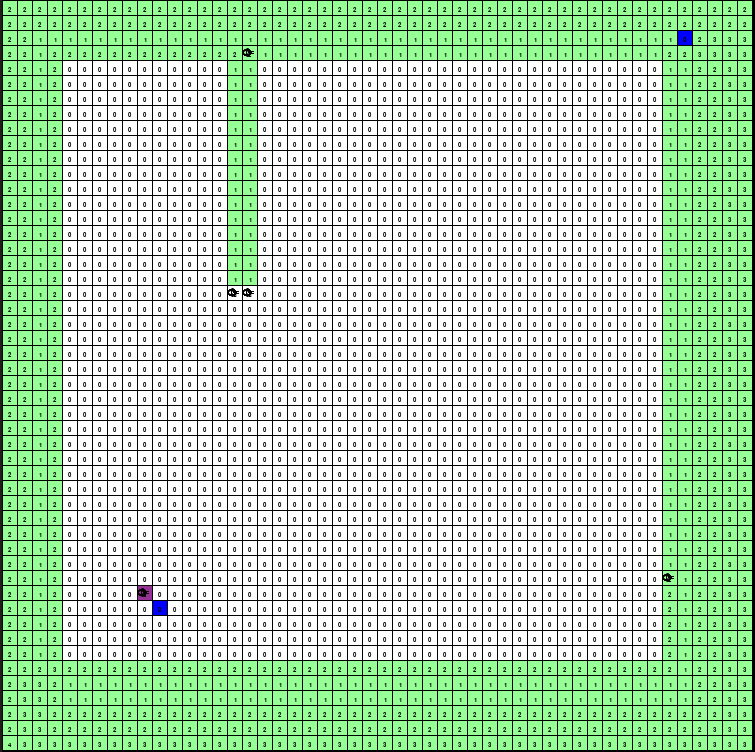

# patrolling algorithm

The test platform was built using the PyGame library. The scenario is a 50×50 grid containing four UAVs modeled as robot-agents  and two stationary recharging stations (blue points). The aerial robots can navigate through the scenario, detect the recharging stations,  and  interact with each other when they are within the communication range. The starting position of the UAVs is at the lower-left corner of the area.  
 

## NC Drone
For the UVAs moviments we implemented the NC Drone algorithm. The NC is an RTSM which guides biologically-inspired robots over a grid-discretized scenario by reading and writing pheromones for motion planning.  
The primary goal of the NC-Drone is to reduce excessive NTM while keeping unpredictable behavior by solving the tie issue. NC-Drone checks the position of the cells with the same minimum-value. In the case of one of these cells is following the sweeping direction, this cell is picked as the next spot to be explored. In this way, the aerial vehicle maintains a straight trajectory. If there is no such cell, a random decision is made, and the UAV performs a turn to reach the selected side cell.

## Patrolling
The UAVs must perform the patrolling while searching for a target along the area. We explore three different scenarios, one  with a stationary target, one with a mobile target withrandom  motion, and one with an intelligent target.The random mobile  target moves using classical NC. The intelligent mobile target changes its direction in a variety of intervals randomly  selected from 30 to 50 cycles. This target can also detect UAVs five cells away and evade them by choosing a different  direction to go. In  this  case, if two vehicles are coming, one from the left and one from behind,the target then chooses to go straight or to the right.

## Simulation Scenario

